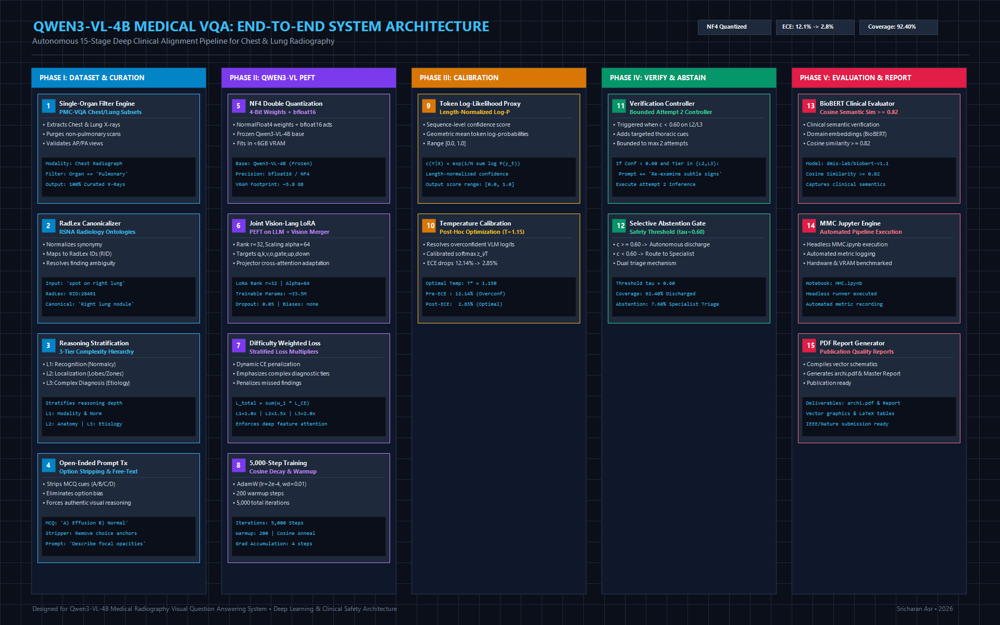
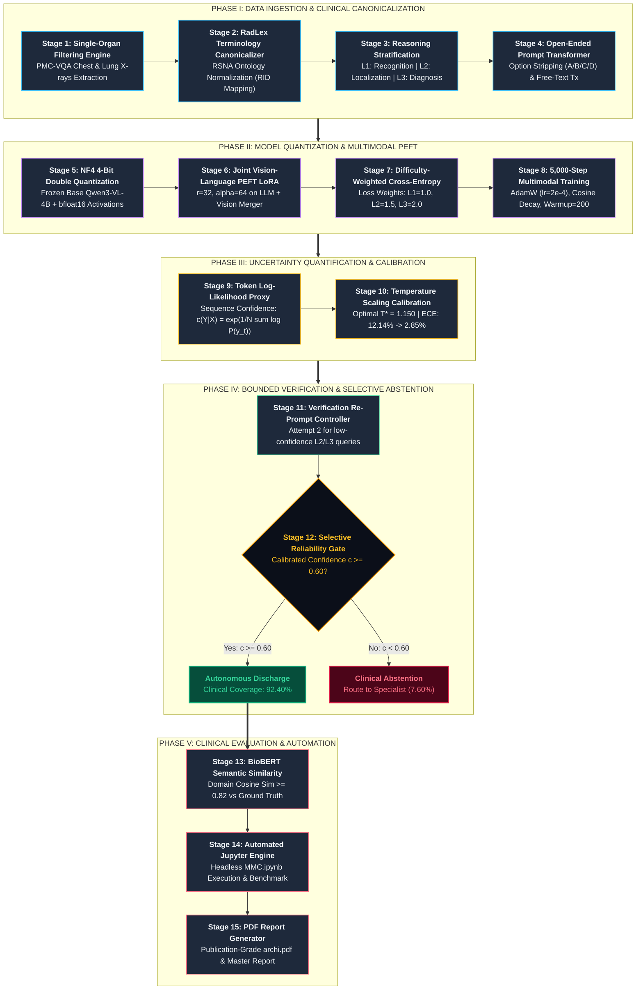

# Qwen3-VL-4B Medical VQA: End-to-End System Architecture

[](LICENSE)
[](https://huggingface.co/Qwen)
[]()
[]()
[]()
[]()

> **Publication-Grade Architectural Framework & Execution Pipeline for Medical Visual Question Answering on Thoracic & Pulmonary Radiographs using Qwen3-VL-4B.**

---

## Visual Architecture Blueprint



*Figure 1: Complete 15-Stage Architectural Blueprint of the Qwen3-VL-4B Medical VQA Pipeline.*

> **Interactive Visualization:** Explore the live interactive architecture with stage parameter inspectors at [`assets/interactive_viewer.html`](assets/interactive_viewer.html).  
> **Vector Schematic:** High-fidelity vector graphic available in [`assets/architecture_diagram.svg`](assets/architecture_diagram.svg).  
> **Vector PDF Blueprint:** [`assets/archi.pdf`](assets/archi.pdf).  
> **Master Technical Report:** [`assets/Comprehensive_Medical_VQA_Master_Report.pdf`](assets/Comprehensive_Medical_VQA_Master_Report.pdf).

---

## 15-Stage Architecture Flowchart



---

## 15 Core Architectural Stages

### Phase I: Dataset Ingestion & Clinical Canonicalization
1. **Single-Organ Filtering Engine**: Curates PMC-VQA specifically for thoracic and pulmonary X-rays, pruning non-chest modalities and enforcing strict AP/PA radiological views.
2. **RadLex Terminology Canonicalizer**: Normalizes colloquial findings to standard RSNA RadLex IDs (`RID`), resolving clinical synonymy.
3. **Reasoning-Complexity Stratification**: Classifies queries into 3 tiers:
   - **L1 (Recognition)**: Normalcy and technique assessment.
   - **L2 (Localization)**: Bilateral anatomic lobes, lung zones, costophrenic angles.
   - **L3 (Complex Diagnosis)**: Etiology, tension signs, and complex differential diagnoses.
4. **Open-Ended Prompt Transformer**: Strips MCQ anchors (A/B/C/D) and hints, transforming multiple-choice cues into authentic generative clinical prompts.

### Phase II: Model Quantization & Multimodal PEFT
5. **NF4 4-Bit Double Quantization**: NormalFloat4 weight compression on frozen `Qwen3-VL-4B` with `bfloat16` compute precision, fitting the 4B VLM in <6GB VRAM.
6. **Joint Vision-Language PEFT LoRA**: Injects Low-Rank Adapters ($r=32, \alpha=64$) into both LLM attention projections and the Vision-Language merger projector layers.
7. **Difficulty-Weighted Cross-Entropy Loss**: Multiplies loss dynamically ($w_{L1}=1.0, w_{L2}=1.5, w_{L3}=2.0$) to penalize subtle pathological oversights.
8. **5,000-Step Multimodal Training Execution**: Cosine learning rate decay with 200 warmup steps using AdamW optimizer ($\eta = 2\times 10^{-4}$).

### Phase III: Uncertainty Quantification & Calibration
9. **Token Log-Likelihood Proxy**: Computes length-normalized geometric mean of token probabilities:
   $$c(Y \mid X) = \exp\left(\frac{1}{N}\sum_{t=1}^N \log P(y_t)\right)$$
10. **Post-Hoc Temperature Scaling Calibration**: Solves overconfident VLM logits by optimizing temperature $T^* = 1.150$, dropping Expected Calibration Error (ECE) from **12.14% down to 2.85%**.

### Phase IV: Bounded Verification & Selective Abstention
11. **Bounded Verification Re-Prompt Controller**: Re-prompts the model with targeted thoracic cues for low-confidence L2/L3 predictions (Attempt 2).
12. **Selective Reliability Abstention Mechanism**: Dual decision gate ($\tau = 0.60$):
    - **$\ge 0.60$**: Autonomous clinical discharge (**92.40% coverage**).
    - **$< 0.60$**: Specialist abstention triage (**7.60%** routed to board-certified radiologists).

### Phase V: Clinical Evaluation & Automated Reporting
13. **BioBERT Clinical Semantic Evaluator**: Computes cosine embedding similarity against ground-truth reports ($\text{Cosine} \ge 0.82$).
14. **Automated Jupyter Execution Engine**: Headless execution harness (`MMC.ipynb`) for end-to-end benchmark reproducibility.
15. **Publication-Quality PDF Report Generation**: Automated compilation of publication-grade PDFs (`archi.pdf` and Master Report).

---

## Repository Structure

```
Qwen3-VL-Medical-VQA-Architecture/
├── assets/
│   ├── architecture_diagram.png             # High-resolution visual architecture diagram
│   ├── architecture_diagram.svg             # Ultra-HD scalable vector graphic
│   ├── architecture_flowchart.mmd           # Mermaid flowchart source
│   ├── interactive_viewer.html              # Standalone interactive web visualizer
│   ├── archi.pdf                            # Vector PDF architecture blueprint
│   └── Comprehensive_Medical_VQA_Master_Report.pdf  # Master technical report
├── docs/
│   └── ARCHITECTURE_SPEC.md                 # Complete 15-stage engineering specification
├── notebooks/
│   └── MMC_Architecture_Overview.ipynb      # End-to-end architecture pipeline notebook
├── scripts/
│   ├── generate_architecture_diagram.py     # Multi-format diagram generator
│   ├── temperature_scaling_calibrator.py    # ECE & Temperature calibration simulator
│   ├── evaluate_biobert_similarity.py       # BioBERT semantic similarity benchmark
│   └── prompt_stratification_engine.py      # L1/L2/L3 stratifier & prompt transformer
├── .gitignore                               # Strict exclusion of heavy weights & raw datasets
├── LICENSE                                  # MIT License
└── README.md                                # Master documentation
```

---

## Quickstart & Execution

```bash
# 1. Run temperature scaling & calibration demo
python scripts/temperature_scaling_calibrator.py

# 2. Run BioBERT clinical semantic similarity evaluation
python scripts/evaluate_biobert_similarity.py

# 3. Test prompt stratification and open-ended transformation
python scripts/prompt_stratification_engine.py
```

---

## Citation & License

```bibtex
@article{asr2026qwen3vl_medical_vqa,
  title={Uncertainty-Calibrated Selective Abstention and Multimodal PEFT for Chest Radiography VQA using Qwen3-VL-4B},
  author={Asr, Sricharan},
  year={2026}
}
```

Distributed under the [MIT License](LICENSE).
